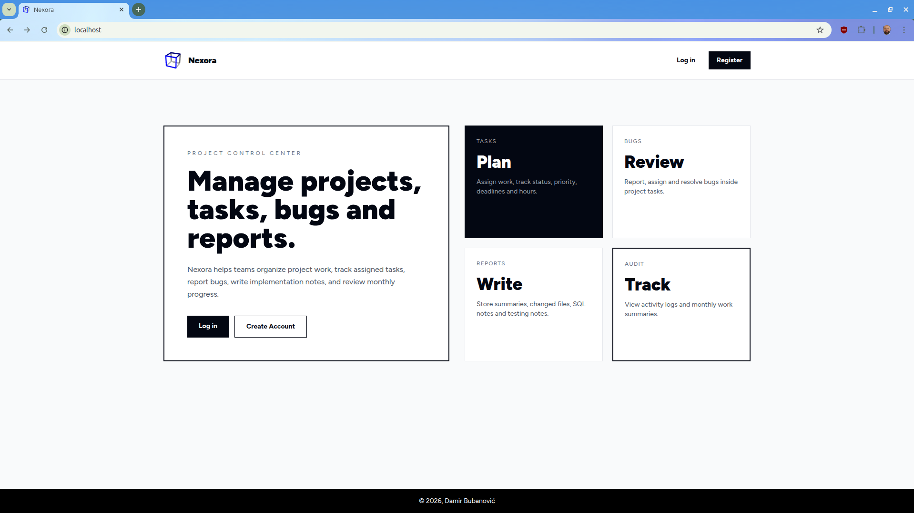

<p align="center">
  
</p>

# Nexora

**Nexora** is a Laravel-based project and task management system focused on structured workflows, role-based access control, and clean UI design.

It provides a full-featured environment for managing projects, tasks, bugs, reports, and user activity with a clear separation of responsibilities between admins, developers, and clients.

---

## 🚀 Features

### Authentication & Security
- User registration, login, logout
- Email verification system
- Password reset & confirmation
- Role-based access control (`admin`, `developer`, `client`)
- Protected routes and authorization checks

### Projects
- Create, edit, delete projects (admin)
- Assign users to projects
- Project status tracking (`active`, `pending`, `completed`)
- Start and end dates
- Search and filter projects

### Tasks
- Create tasks within projects
- Assign tasks to users
- Status management (`pending`, `active`, `completed`)
- Priority system
- Due dates
- Estimated vs actual hours tracking
- Cost tracking per task
- Quick inline status updates

### Bugs
- Report bugs per task
- Assign bugs to users
- Status tracking:
  - `open`
  - `in_progress`
  - `resolved`
- Role-based editing permissions

### Reports
- Create detailed task reports including:
  - summary
  - changed files
  - changed lines
  - SQL queries
  - testing notes
- View report history
- Export reports
- Download reports as `.md`

### Revisions
- Create revisions for reports
- Track revision number and status
- Maintain history of report changes

### Activity Logs
- Track system activity:
  - user actions
  - entity changes
- Filter by:
  - user
  - action
  - type
- Paginated log viewer

### Work Summary
- Monthly overview of:
  - completed tasks
  - reports created
  - total hours worked

### User Management (Admin)
- View all users
- Change user roles
- Manage permissions across the system

### UI / UX
- Clean minimal UI (Tailwind CSS)
- Consistent component-based design
- Status badges for quick visual feedback
- Responsive layout
- Custom-designed authentication screens

---

## 🛠 Tech Stack

- **Backend:** Laravel, Eloquent ORM  
- **Frontend:** Blade, Tailwind CSS, Alpine.js  
- **Database:** MySQL  
- **Dev Environment:** Docker (Laravel Sail)  
- **Tools:** Composer, npm  

---

## 📦 Installation

```bash
git clone https://github.com/damir-bubanovic/nexora.git
cd nexora

cp .env.example .env

./vendor/bin/sail up -d
./vendor/bin/sail composer install
./vendor/bin/sail artisan key:generate
./vendor/bin/sail artisan migrate

./vendor/bin/sail npm install
./vendor/bin/sail npm run dev
```

Open in browser:
http://localhost

---

## 🔐 Demo Roles

- **Admin** → full control (projects, users, logs)  
- **Developer** → tasks, bugs, reports  
- **Client** → limited access (view data)  

---

## 📁 Folder Structure

```
app/
  Models/
  Http/Controllers/

resources/
  views/
    layouts/
    components/
    projects/
    tasks/
    reports/
    bugs/

routes/
database/
public/
  images/
```

---

## 🧪 Development Notes

- Blade components used for reusable UI  
- Tailwind CSS for styling  
- Laravel policies for authorization  
- Modular structure (Projects → Tasks → Bugs → Reports → Revisions)  
- Activity logging implemented across system actions  

---

## ⚙️ Production Build

```bash
./vendor/bin/sail artisan optimize
./vendor/bin/sail npm run build
```

.env:
```
APP_ENV=production
APP_DEBUG=false
APP_URL=https://your-domain.com
```

---

## 📌 Current Status

- Authentication system complete  
- Project management complete  
- Task system with tracking implemented  
- Bug tracking system implemented  
- Reports and revisions complete  
- Activity logging implemented  
- UI design system applied  
- Ready for deployment  

---

## 👤 Creator

Damir Bubanović  
https://github.com/damir-bubanovic  

---

## 🙌 Acknowledgments

Built with Laravel, Tailwind CSS, Alpine.js, and Laravel Sail.